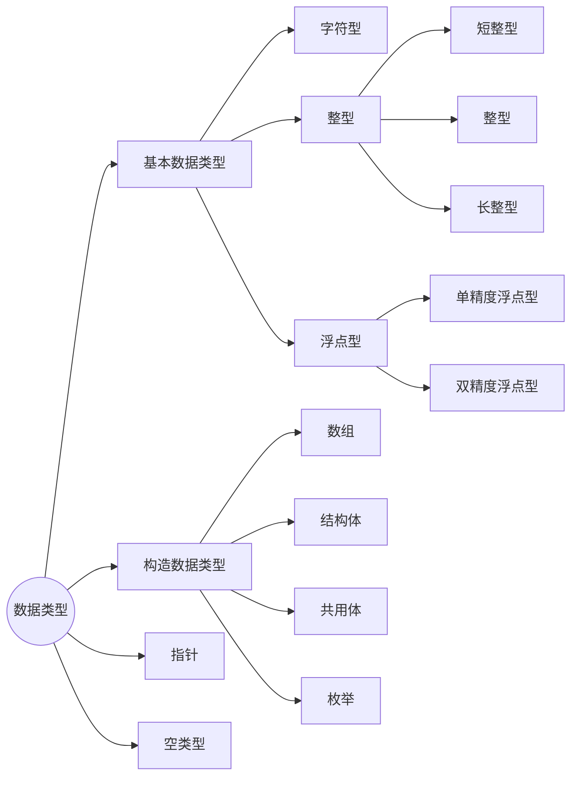
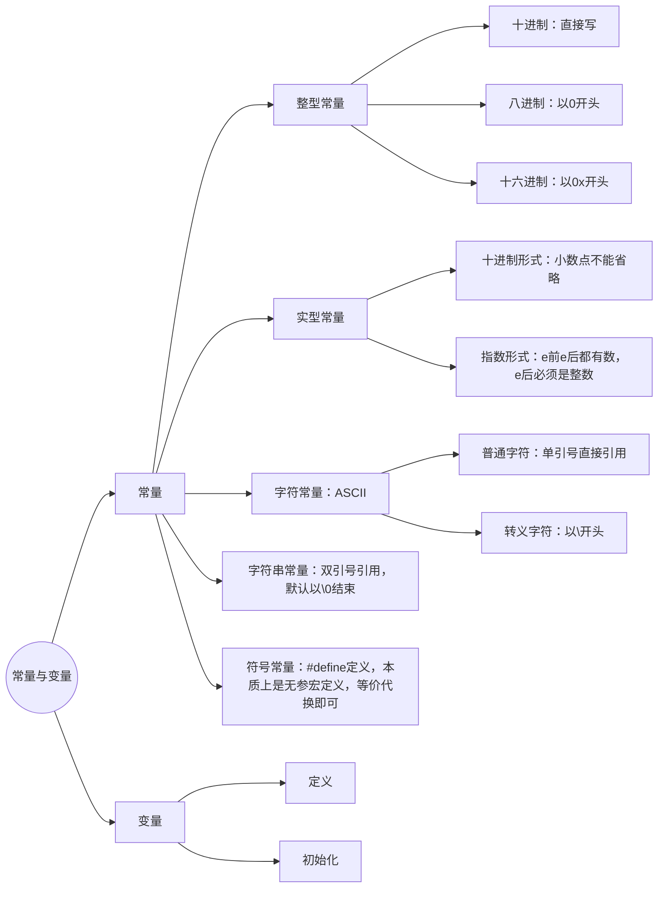

## 一、认识C语言

### 计算机语言的分类

1. 计算机语言分为**机器语言**、**汇编语言**、**高级语言**。
2. 机器语言和汇编语言统称**低级语言**。
3. 能够被计算机直接执行的语言是**机器语言**。
4. C 语言是**高级语言**，不能直接被计算机执行，需要进行编译。

### C 语言的编译过程

```text
编辑 > 源程序(.c 文本文件) — 编译 > 目标文件(.obj 二进制文件) — 连接 > 可执行文件(.exe 二进制文件) — 执行
```

其中：

- **源程序**、**目标程序**不能被计算机直接执行；
- 只有**可执行文件**能够被直接执行。

### C 程序的结构

### （一）函数

#### 1. C 程序的构成

C 语言程序由若干函数组成，**函数是 C 程序的基本单位**。

1. 必须有一个且只能有一个主函数 `main()`，主函数的名字为 `main`，主函数是一个程序的入口，也是一个程序的出口。
2. 可以是系统预定义的标准函数，如 `scanf` 函数、`printf` 函数等。
3. 大多数函数由程序员根据实际问题的需要进行定义，函数之间是平行的关系。基于此，C 语言被称为**函数式语言**。

```例子
# include "stdio.h"             #这里引入了标准输入输出头文件
void main()                     #主函数的函数头
{int a, b;                      #定义整形变量a,b
int sum;                        #定义整形变量sum
printf("请输入两个整数a,b:");   #输出文本
scanf("%d,%d",&a,&b);           #输入两个整数%d会被后面的&a取缔
sum=a+b;                        #将赋值后的a,b运算
printf("和一%dn",sum);          #输出运算结果

输入数据:1999,5
运行结果：和=2004
```

#### 2. 函数的构成

函数由**函数头**（函数的说明部分）与**函数体**（函数的语句部分）两部分组成。

1. **函数头**：给出函数的特征描述，包括函数的**属性、类型、名字、参数及参数类型**。
2. **函数体**：给出函数功能实现的**数据描述**（声明部分）和**操作描述**（执行部分），是程序中用花括号括起的若干语句。

### （二）语句

1. 语句是组成程序的**最小单位**，函数功能的实现由若干条语句完成。
2. 语句由若干关键字加以标识，如 `if-else` 语句、`do-while` 语句等。
3. C 语言本身没有输入/输出语句，C 语言的输入/输出操作由 `scanf` 函数和 `printf` 函数等**库函数**完成。
4. C 语言语句必须以**分号**结束。
5. 只有分号构成的语句叫**空语句**，也会被编译执行。

### （三）标识符

标识符在程序中用来标识各种程序成份，命名程序中的一些实体，如**变量、常量、函数、类型、标号**等对象的名字。

C 语言规定，标识符必须以**英文字母或下划线开头**，是**字母、数字、下划线**的序列。

**合法的标识符：**

```text
i, j, k, x, c, al, a2, op, y_l, zhou_prg, radius, prime, program, sort, max, min, prg_l, cout, sun, day
```

**不合法的标识符：**

```text
a.l, 1computer, x+y, !abc, 99999, $100, π, 3c
```

#### 用户自定义标识符规则⭐⭐⭐

1. 由**数字、字母、下划线**构成
2. **数字不能开头**
3. **严格区分大小写**
4. **不使用关键字**

### C 语言 32 个标准关键字

### 一、基本数据类型（10 个）

- `char`：字符型
- `int`：整型
- `float`：单精度浮点型
- `double`：双精度浮点型
- `void`：空类型
- `long`：长整型
- `short`：短整型
- `signed`：有符号数
- `unsigned`：无符号数
- `enum`：枚举

### 二、流程控制语句（12 个）

- `if`：如果
- `else`：否则
- `switch`：开关（多分支）
- `case`：多分支
- `default`：默认
- `do`：循环
- `while`：循环
- `for`：循环
- `break`：跳出
- `continue`：继续
- `goto`：跳转
- `return`：返回

### 三、构造 / 自定义数据类型（3 个）

- `union`：共用体
- `struct`：结构体
- `typedef`：起别名

### 四、存储类型（4 个）

- `auto`：自动
- `static`：静态
- `extern`：外部
- `register`：寄存器

### 五、运算符 / 修饰关键字（3 个）

- `sizeof`：求字节大小
- `const`：常量
- `volatile`：易变

### （四）运算符

运算符实际上可以认为是系统定义的**函数名字**，这些函数作用于运算对象，得到一个结果值。运算符通常由 1 个或多个字符构成。

C 语言沿用了大量的常规运算符，如加法运算符 `+`、减法运算符 `-`、地址运算符 `&`、大于运算符 `>`、不等运算符 `!=`、逻辑与运算符 `&&`、条件运算符 `?:`、点运算符 `.`、字节数运算符 `sizeof` 等。

根据运算对象的个数不同，可分为**单目运算符、双目运算符和三目运算符**，又称为**一元运算符、二元运算符和三元运算符**。

#### 运算符举例

| 类型               | 运算对象个数 | 常见运算符                              | 示例                       |
| ------------------ | ------------ | --------------------------------------- | -------------------------- |
| 单目运算符（一元） | 1 个         | `-`、`!`、`&`、`++`、`--`、`sizeof`     | `-a`、`!a`、`&a`、`a++`    |
| 双目运算符（二元） | 2 个         | `+`、`-`、`*`、`/`、`%`、`=`、`>`、`&&` | `a + b`、`a > b`、`a && b` |
| 三目运算符（三元） | 3 个         | `?:`                                    | `a > b ? a : b`            |

以三目运算符为例：`max = (a > b) ? a : b;`，当条件 `a > b` 成立时取 `a`，否则取 `b`。

### 总结

1. C 语言程序由若干函数组成，**函数是 C 程序的基本单位**。
2. 必须有一个且只能有一个主函数 `main()`，主函数是一个程序的入口，也是一个程序的出口。
3. 语句是组成程序的**最小单位**。
4. 标识符命名规则：
   1. 只能由数字、字母、下划线组成。
   2. 不能以数字开头。
   3. 严格区分大小写。
   4. 不能以关键字命名。

### 数制及其转化单位

| 进制     | 数码     | 基数 | 位权 | 尾符 |
| -------- | -------- | ---- | ---- | ---- |
| 二进制   | 0~1      | 2    | 2^n  | B    |
| 八进制   | 0~7      | 8    | 8^n  | O、Q |
| 十进制   | 0~9      | 10   | 10^n | D    |
| 十六进制 | 0~9、A~F | 16   | 16^n | H    |

### （一）非十进制数转十进制数

**口诀：**
每位上的数码 × 基数 ^ 位次方 求和。（每位上的数码乘以对应基数的次方再相加）

**例1：** 1101B = \_\_\_\_D

```
1101B = 1×2³ + 1×2² + 0×2¹ + 1×2⁰
      = 8 + 4 + 0 + 1
      = 13
```

所以 1101B = 13D

**口诀应用示例（十六进制转十进制）：**

**例2：** 2A6H = \_\_\_\_D

```
2A6H = 2×16² + 10×16¹ + 6×16⁰
     = 512 + 160 + 6
     = 678
```

所以 2A6H = 678D

### （二）十进制数转非十进制数

**口诀：**
整数部分：除 N 取余，商为 0 时，将余数部分**倒序**输出。
小数部分：乘 N 取整，积为 0 时，将整数部分**正序**输出。

**例1：** 13D = \_\_\_\_B

```
13 ÷ 2 = 6 …… 余 1
 6 ÷ 2 = 3 …… 余 0
 3 ÷ 2 = 1 …… 余 1
 1 ÷ 2 = 0 …… 余 1
余数倒序：1101
```

所以 13D = 1101B

**例2：** 0.25D = \_\_\_\_B（小数部分）

```
0.25 × 2 = 0.5 …… 整数部分 0
 0.5 × 2 = 1.0 …… 整数部分 1（积为 0，停止）
整数部分正序：01
```

所以 0.25D = 0.01B

### （三）二进制和八进制的转换（421 法则）

每 **3 位二进制数**等价于 **1 位八进制数**。

| 二进制 | 八进制 | 二进制 | 八进制 |
| ------ | ------ | ------ | ------ |
| 000    | 0      | 100    | 4      |
| 001    | 1      | 101    | 5      |
| 010    | 2      | 110    | 6      |
| 011    | 3      | 111    | 7      |

**421 法则：** 每 3 位二进制数的权重依次为 4、2、1，将每位二进制数码乘以对应权重后求和，即为该组的八进制数。

**例1：** 110101B = \_\_\_\_O

```
将二进制数每 3 位一组（从右往左）：
110 101
├─┼─┼──┐
110 = 1×4 + 1×2 + 0×1 = 6
101 = 1×4 + 0×2 + 1×1 = 5
```

所以 110101B = 65O

**例2：** 47O = \_\_\_\_B（八进制转二进制）

```
每一位八进制数写成对应的 3 位二进制数：
4 = 100
7 = 111
```

所以 47O = 100111B

### （四）二进制和十六进制的转换（8421 法则）

每 **4 位二进制数**等价于 **1 位十六进制数**。

| 二进制 | 十六进制 | 二进制 | 十六进制 |
| ------ | -------- | ------ | -------- |
| 0000   | 0        | 1000   | 8        |
| 0001   | 1        | 1001   | 9        |
| 0010   | 2        | 1010   | A        |
| 0011   | 3        | 1011   | B        |
| 0100   | 4        | 1100   | C        |
| 0101   | 5        | 1101   | D        |
| 0110   | 6        | 1110   | E        |
| 0111   | 7        | 1111   | F        |

**8421 法则：** 每 4 位二进制数的权重依次为 8、4、2、1，将每位二进制数码乘以对应权重后求和，即为该组的十六进制数。

**例1：** 10110101B = \_\_\_\_H

```
将二进制数每 4 位一组（从右往左）：
1011 0101
├──┼──┐
1011 = 1×8 + 0×4 + 1×2 + 1×1 = 11 = B
0101 = 0×8 + 1×4 + 0×2 + 1×1 = 5
```

所以 10110101B = B5H

**例2：** 3F2H = \_\_\_\_B（十六进制转二进制）

```
每一位十六进制数写成对应的 4 位二进制数：
3 = 0011
F = 1111
2 = 0010
```

所以 3F2H = 001111110010B

### 本章总结

1. **非十进制数转十进制数**：每位上的数码 × 基数^位次方 求和。
2. **十进制数转非十进制数**：
   - 整数部分：除 N 取余，商为 0 时，将余数部分**倒序**输出。
   - 小数部分：乘 N 取整，积为 0 时，将整数部分**正序**输出。
3. **二进制和八进制的转换**：每 3 位二进制数等价于 1 位八进制数。
4. **二进制和十六进制的转换**：每 4 位二进制数等价于 1 位十六进制数。

### 二进制数的算术、逻辑运算

### （一）算术运算

#### 1. 加法

**运算规则：** 逢二进一

```
0 + 0 = 0
0 + 1 = 1
1 + 0 = 1
1 + 1 = 10（向高位进位）
```

**例1：** 1101B + 1011B = \_\_\_\_B

```
  1101
+ 1011
------
 11000
```

验算：1101B = 13D，1011B = 11D，13 + 11 = 24D = 11000B ✓

**例2：** 101B + 1B = \_\_\_\_B

```
  101
+  001
------
  110
```

所以 101B + 1B = 110B

**例3（八进制加法，逢八进一）：** 75O + 6O = \_\_\_\_O

```
   75
+   6
------
  103
```

逐位计算（从低位到高位）：

```
5 + 6 = 11 = 13O → 本位 3，进位 1
7 + 0 + 进位1 = 8 = 10O → 本位 0，进位 1
```

验算：75O = 61D，6O = 6D，61 + 6 = 67D = 103O ✓

**例4（十六进制加法，逢十六进一）：** A9H + B2H = \_\_\_\_H

```
   A9
+  B2
------
  15B
```

逐位计算（从低位到高位）：

```
9 + 2 = 11 = B → 本位 B，无进位
A + B = 10 + 11 = 21 = 15H → 本位 5，进位 1
```

验算：A9H = 169D，B2H = 178D，169 + 178 = 347D = 15BH ✓

#### 2. 减法

**运算规则：** 借一为二（向高位借 1，当作 2 使用）

```
0 - 0 = 0
1 - 1 = 0
1 - 0 = 1
10 - 1 = 1（借位：向高位借 1，即 2 - 1 = 1）
```

**例1：** 1101B - 1011B = \_\_\_\_B

```
  1101
- 1011
------
  0010
```

逐位计算（从低位到高位）：

```
1 - 1 = 0 → 本位 0，无借位
0 - 1：不够减，向高位借 1（10 - 1 = 1）→ 本位 1，借位 1
1 - 0 - 借位1 = 0 → 本位 0，无借位
1 - 1 - 借位0 = 0 → 本位 0
```

验算：1101B = 13D，1011B = 11D，13 - 11 = 2D = 0010B ✓

**例2（八进制减法，借一为八）：** 102O - 5O = \_\_\_\_O

```
  102
- 005
------
  075
```

逐位计算（从低位到高位）：

```
2 - 5：不够减，向高位借 1（当 8 用），10 - 5 = 5 → 本位 5，借位 1
0 - 0 - 借位1：不够减，再向高位借 1，10 - 1 = 7 → 本位 7，借位 1
1 - 0 - 借位1 = 0 → 本位 0
```

验算：102O = 66D，5O = 5D，66 - 5 = 61D = 75O ✓

**例3（十六进制减法，借一为十六）：** 50H - 2H = \_\_\_\_H

```
  50
-  02
------
  4E
```

逐位计算（从低位到高位）：

```
0 - 2：不够减，向高位借 1（当 16 用），16 - 2 = 14 = E → 本位 E，借位 1
5 - 0 - 借位1 = 4 → 本位 4
```

验算：50H = 80D，2H = 2D，80 - 2 = 78D = 4EH ✓

### （二）逻辑运算

#### 1. 逻辑与

**运算符：** ∧ 或 AND

**运算规则：** 一假即假（两个都为 1 时结果才为 1）

```
0 ∧ 0 = 0
0 ∧ 1 = 0
1 ∧ 0 = 0
1 ∧ 1 = 1
```

**例：** 1101B ∧ 1011B = \_\_\_\_B

```
  1101
∧ 1011
------
  1001
```

逐位计算：

```
1 ∧ 1 = 1
1 ∧ 0 = 0
0 ∧ 1 = 0
1 ∧ 1 = 1
```

所以 1101B ∧ 1011B = 1001B

#### 2. 逻辑或

**运算符：** ∨ 或 OR

**运算规则：** 一真即真（两个都为 0 时结果才为 0）

```
0 ∨ 0 = 0
0 ∨ 1 = 1
1 ∨ 0 = 1
1 ∨ 1 = 1
```

**例：** 1101B ∨ 1011B = \_\_\_\_B

```
  1101
∨ 1011
------
  1111
```

逐位计算：

```
1 ∨ 1 = 1
1 ∨ 0 = 1
0 ∨ 1 = 1
1 ∨ 1 = 1
```

所以 1101B ∨ 1011B = 1111B

#### 3. 逻辑非

**运算符：** ¬ 或 NOT

**运算规则：** 真亦假时假亦真（取反，1 变 0，0 变 1）

```
¬0 = 1
¬1 = 0
```

**例：** ¬1101B = \_\_\_\_B

```
逐位取反：
1 → 0
1 → 0
0 → 1
1 → 0
```

所以 ¬1101B = 0010B

#### 4. 异或

**运算符：** ⊕ 或 XOR

**运算规则：** 相同为 0，不同为 1

```
0 ⊕ 0 = 0
0 ⊕ 1 = 1
1 ⊕ 0 = 1
1 ⊕ 1 = 0
```

**例：** 1101B ⊕ 1011B = \_\_\_\_B

```
  1101
⊕ 1011
------
  0110
```

逐位计算：

```
1 ⊕ 1 = 0
1 ⊕ 0 = 1
0 ⊕ 1 = 1
1 ⊕ 1 = 0
```

所以 1101B ⊕ 1011B = 0110B

## 二、数据类型



### （一）常用基本数据类型

| 类型   | 符号 | 关键字           | 字节数 | 所占位数 | 数的表示范围           |
| ------ | ---- | ---------------- | ------ | -------- | ---------------------- |
| 字符型 | 有   | `char`           | 1      | 8        | -128~127               |
| 字符型 | 无   | `unsigned char`  | 1      | 8        | 0~255                  |
| 整型   | 有   | `(signed) short` | 2      | 16       | -32768~32767           |
| 整型   | 有   | `(signed) int`   | 2      | 16       | -32768~32767           |
| 整型   | 有   | `(signed) long`  | 4      | 32       | -2147483648~2147483647 |
| 整型   | 无   | `unsigned`       | 2      | 16       | 0~65535                |
| 整型   | 无   | `unsigned short` | 2      | 16       | 0~65535                |
| 整型   | 无   | `unsigned long`  | 4      | 32       | 0~4294967295           |
| 实型   | 有   | `float`          | 4      | 32       | 3.4e-38~3.4e38         |
| 实型   | 有   | `double`         | 8      | 64       | 1.7e-308~1.7e308       |

### （二）计算机内数据存储基础

在计算机内部，数据是以二进制的形式存储和运算的。计算机内表示的数分成整数和实数两大类。数的正负用高位字节的最高位来表示，定义为**符号位**，用"0"表示正数，"1"表示负数。

例如，二进制数 +1101000 在机器内的表示为：

```text
0 1 1 0 1 0 0 0
↑ 符号位
```

手写笔记整理：

数

- 有符号数：符号位 + 数值位（0 代表正、1 代表负）
  - `00000001`₂ → +1₁₀
  - `10000001`₂ → -1₁₀
- 无符号数：数值位
  - `00000001`₂ → 1₁₀
  - `10000001`₂ → 129₁₀

### （三）原码、反码、补码

有符号数在计算机中有三种表示方法，即**原码、反码和补码**。任何正数这三种码的形式相同，只是负数有各自的不同表示形式。

#### 1. 原码

原码的符号位用 0 表示正数，用 1 表示负数，数值用一般二进制形式表示。

例如：X1=+1001010，X2=-1001010，它们的原码分别为：

$[\text{X1}]_{\text{原}}=01001010$，$[\text{X2}]_{\text{原}}=11001010$

真值示例（8 位）：

| 真值 | +7       | -7       |
| ---- | -------- | -------- |
| 原码 | 00000111 | 10000111 |
| 反码 | 00000111 | 11111000 |
| 补码 | 00000111 | 11111001 |

#### 2. 反码

反码的表示法规定：正数的反码与原码相同，负数的反码是将该数的原码除符号位外其余各位求反。

例如：X1=+1001010，X2=-1001010，它们的反码分别为：

$[\text{X1}]_{\text{反}}=[\text{X1}]_{\text{原}}=01001010$，$[\text{X2}]_{\text{反}}=10110101$

#### 3. 补码

补码的表示法规定：正数的补码与原码相同，负数的补码是先将该数的原码除符号位外其余各位求反，末位再加 1。计算机中通常有符号数的存储是以补码的形式进行存储。

例如：X1=+1001010，X2=-1001010，它们的补码分别为：

$[\text{X1}]_{\text{补}}=[\text{X1}]_{\text{原}}=01001010$，$[\text{X2}]_{\text{补}}=10110110$

#### 4. 核心规则

1. 正数：$[\text{x}]_{\text{原}}=[\text{x}]_{\text{反}}=[\text{x}]_{\text{补}}$
2. 负数：$[\text{x}]_{\text{反}}$ 是 $[\text{x}]_{\text{原}}$ 的符号位不变，数值位取反
3. $[\text{x}]_{\text{补}}=[\text{x}]_{\text{反}}+1$
4. $[[\text{x}]_{\text{补}}]_{\text{补}}=[\text{x}]_{\text{原}}$

#### 5. n 位整数取值范围

- n 位无符号整数取值范围：$0 \sim 2^n - 1$
- n 位有符号整数（补码）取值范围：$-2^{n-1} \sim +2^{n-1} - 1$

### （四）常量与变量



#### 转义字符及其含义

| 转义字符 | 含义 | 转义字符 | 含义 |
| -------- | ---- | -------- | ---- |
| `\n`     | 换行 | `\t`     | 水平制表 |
| `\v`     | 垂直制表 | `\b`  | 退格 |
| `\r`     | 回车 | `\f`     | 换页 |
| `\a`     | 响铃 | `\\`     | 反斜线 |
| `\'`     | 单引号 | `\"`  | 双引号 |
| `\ooo`   | 3 位 8 进制代表的字符 | `\xhh` | 2 位 16 进制代表的字符 |
### （五）自动类型转换

1. `float` 型数据自动转换成 `double` 型；
2. `char` 与 `short` 型数据自动转换成 `int` 型；
3. `int` 型与 `double` 型数据运算，直接将 `int` 型转换成 `double` 型；
4. `int` 型与 `unsigned` 型数据，直接将 `int` 型转换成 `unsigned` 型；
5. `int` 型与 `long` 型数据，直接将 `int` 型转换成 `long` 型。

自动类型转换的规则：

- 若为字符型必须先转换成整型，即其对应的 ASCII 码值；
- 若为单精度型必须先转换成双精度型；
- 若类型不同，将低精度类型转换成高精度类型。

精度从低到高的顺序：`char`/`short` → `int` → `unsigned` → `long` → `float` → `double`

不同类型数据进行运算时，先自动转换成同一类型，然后进行计算。

### （六）强制类型转换

可以利用**强制类型转换运算符**将一个表达式转换成所需类型。

强制类型转换的一般形式为：`（目标类型名）（表达式）`

例如：

- `(int)(a+b)`：强制将 a+b 的值转换成整型
- `(double)x`：将 x 转换成 double 型
- `(float)(10%3)`：将 10%3 的值转换成 float 型

