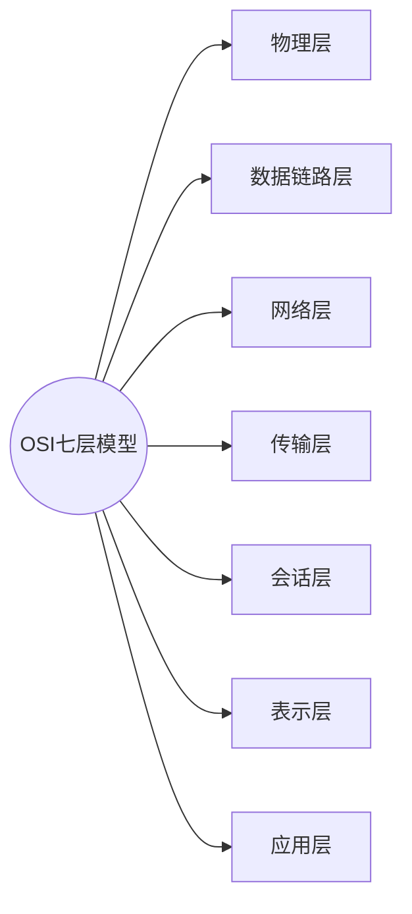
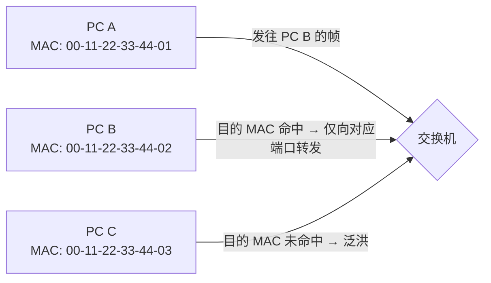
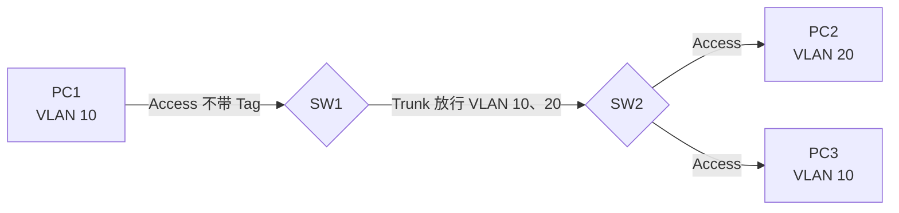
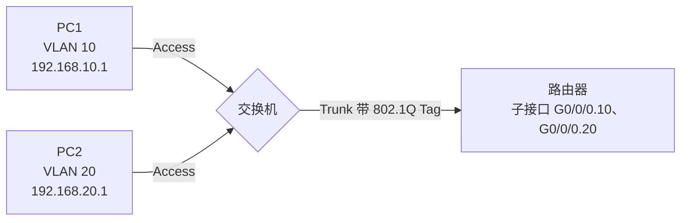
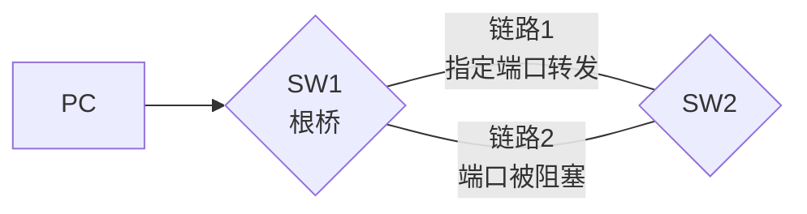
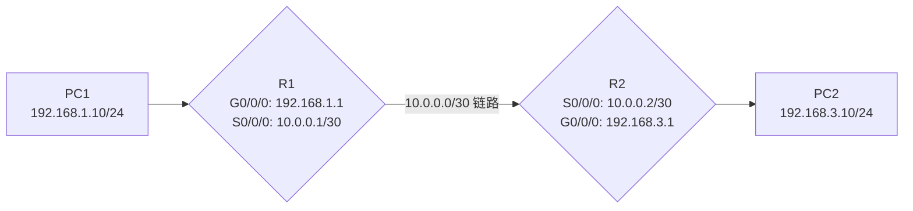
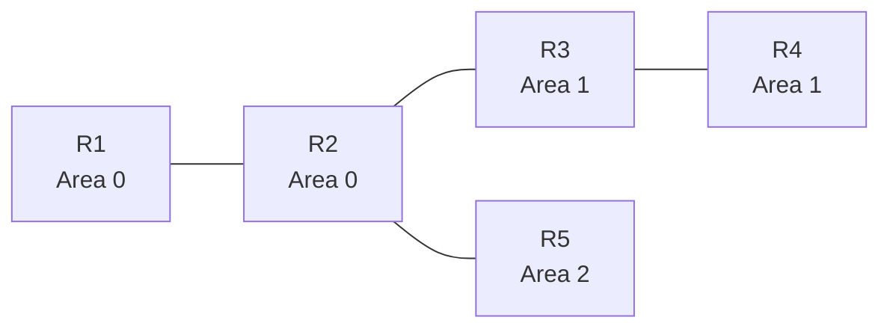
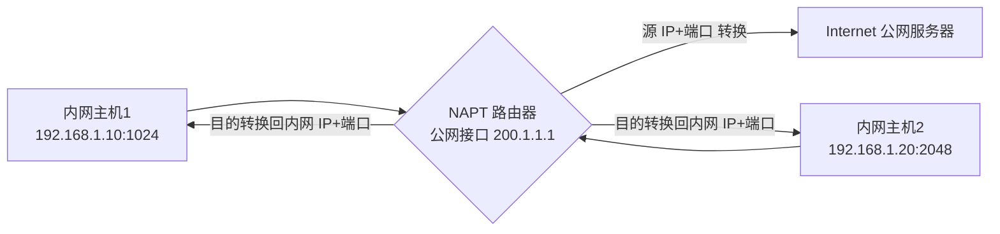
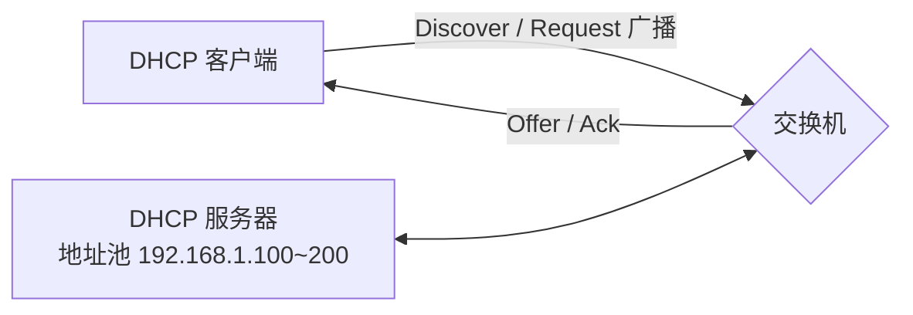

## 一、网络基础

### （一）OSI 七层模型

OSI（开放系统互连）参考模型自下而上分为七层：



**记忆口诀（自下而上）：物数网传会表应**

| 层次 | 作用 | 数据单位 | 典型设备/协议 |
| ---- | ---- | -------- | ------------- |
| 物理层 | 传输比特流 | 比特 bit | 网线、中继器、集线器 |
| 数据链路层 | 帧封装、MAC 寻址、差错检测 | 帧 Frame | 交换机、以太网 |
| 网络层 | 逻辑寻址（IP）、路由选择 | 包 Packet | 路由器、IP 协议 |
| 传输层 | 端到端通信、端口号 | 段 Segment | TCP、UDP |
| 会话层 | 建立/管理/终止会话 | — | NetBIOS |
| 表示层 | 数据格式转换、加密压缩 | — | JPEG、ASCII |
| 应用层 | 为用户提供应用服务 | 数据流 | HTTP、DNS、FTP |

### （二）TCP/IP 协议栈

TCP/IP 四层模型与 OSI 对应关系：

| TCP/IP 四层 | 对应 OSI 层 | 常见协议 |
| ----------- | ----------- | -------- |
| 应用层 | 应用层、表示层、会话层 | HTTP、HTTPS、DNS、FTP、Telnet、SSH、DHCP、SNMP |
| 传输层 | 传输层 | TCP（可靠）、UDP（不可靠） |
| 网络层 | 网络层 | IP、ICMP、ARP、OSPF |
| 网络接口层 | 数据链路层、物理层 | 以太网、PPP |

### （三）TCP 与 UDP

| 特点 | TCP | UDP |
| ---- | --- | --- |
| 连接 | 面向连接（三次握手） | 无连接 |
| 可靠性 | 可靠（确认、重传、排序） | 尽力而为 |
| 传输效率 | 慢 | 快 |
| 典型应用 | HTTP、FTP、Telnet、SMTP | DNS、视频、语音、DHCP |

### （四）常用端口号⭐⭐⭐

| 端口号 | 协议 | 作用 |
| ------ | ---- | ---- |
| 20/21 | FTP | 文件传输（20 数据、21 控制） |
| 22 | SSH | 安全远程管理（加密） |
| 23 | Telnet | 远程管理（明文，不安全） |
| 53 | DNS | 域名解析 |
| 80 | HTTP | 网页访问 |
| 443 | HTTPS | 加密网页访问 |
| 67/68 | DHCP | 67 服务器、68 客户端 |
| 161/162 | SNMP | 网络管理 |

## 二、IP 地址与子网划分⭐⭐⭐

### （一）IP 地址结构

- IP 地址 = 网络位 + 主机位（32 位二进制，点分十进制）
- **子网掩码**：网络位为 1，主机位为 0

### （二）IP 地址分类

| 类别 | 第一字节范围 | 默认掩码 | 用途 |
| ---- | ------------ | -------- | ---- |
| A 类 | 1~126 | 255.0.0.0 | 大型网络 |
| B 类 | 128~191 | 255.255.0.0 | 中型网络 |
| C 类 | 192~223 | 255.255.255.0 | 小型网络 |
| D 类 | 224~239 | — | 组播 |
| E 类 | 240~255 | — | 保留研究 |

**特殊地址：**

- 127.0.0.1：回环地址（本机自测）
- 255.255.255.255：全网广播
- 主机位全 0：网络地址；主机位全 1：广播地址（不可分配给主机）

### （三）私有地址（内网使用，公网不可路由）

- A 类：10.0.0.0/8
- B 类：172.16.0.0/12（172.16.0.0 ~ 172.31.255.255）
- C 类：192.168.0.0/16

### （四）子网划分公式

- 划分出子网数 = 2^n（n = 借用的主机位数）
- 每子网可用主机数 = 2^m - 2（m = 剩余主机位数，减网络地址和广播地址）
- CIDR 表示法：/24 表示掩码 255.255.255.0（24 个 1）

**例：** 192.168.1.0/24 划分为 4 个子网：借 2 位主机位，子网掩码变为 /26（255.255.255.192），每个子网可用主机数 = 2^6 - 2 = 62 台。

### （五）VLSM 可变长子网掩码

不同子网可以使用不同长度的掩码，节省 IP 地址（如骨干网用 /30 只占 2 个可用地址）。

## 三、以太网与交换机

### （一）MAC 地址

- 48 位二进制（12 位十六进制），前 24 位为厂商 OUI，后 24 位为唯一标识
- 全球唯一，烧录在网卡上
- 单播 MAC：第一个字节最低位为 0；组播为 1；FF-FF-FF-FF-FF-FF 为广播

### （二）以太网帧格式

| 字段 | 长度 | 作用 |
| ---- | ---- | ---- |
| 前导码 | 7+1 字节 | 同步时钟 |
| 目的 MAC | 6 字节 | 接收方地址 |
| 源 MAC | 6 字节 | 发送方地址 |
| 类型 | 2 字节 | 上层协议（0x0800=IPv4、0x0806=ARP） |
| 数据 | 46~1500 字节 | 上层数据 |
| FCS | 4 字节 | 帧校验序列（CRC） |

### （三）交换机工作原理⭐⭐⭐

交换机维护一张 **MAC 地址表**（MAC ↔ 端口 映射），转发行为有三种：

1. 查表命中，目的端口与源端口不同 → **转发**
2. 查表命中，目的端口与源端口相同 → **丢弃**
3. 查表未命中 → **泛洪**（向除源端口外所有端口转发）



**交换机隔离冲突域，不隔离广播域；路由器隔离广播域。**

## 四、VLAN⭐⭐⭐

### （一）VLAN 的作用

- 隔离**广播域**，抑制广播风暴
- 增强网络安全（不同 VLAN 默认不能互访）
- 便于灵活管理

### （二）VLAN 划分方式

基于端口（最常用）＞ 基于 MAC 地址 ＞ 基于协议 ＞ 基于 IP 子网

### （三）VLAN 范围

- 0~4095 共 4096 个，可用 1~4094
- 默认所有端口属于 **VLAN 1**
- VLAN 1 不可删除

### （四）端口类型⭐⭐⭐

| 端口类型 | 连接对象 | 数据帧处理 |
| -------- | -------- | ---------- |
| Access | 终端（PC） | 只属于一个 VLAN，PVID=该 VLAN，发送不带 Tag |
| Trunk | 交换机 | 默认只放行 VLAN 1，需手动允许其他 VLAN；除 PVID 外都带 Tag |
| Hybrid | 任意 | 华为默认端口类型，可灵活配置 Tagged/Untagged |

帧标签协议：**802.1Q**（在源 MAC 后插入 4 字节 Tag）。



同 VLAN 10 的 PC1 与 PC3 可跨交换机通信；VLAN 10 与 VLAN 20 之间默认隔离。

### （五）VLAN 间路由

1. **单臂路由**：路由器子接口（`dot1q termination vid`）对接 Trunk
2. **三层交换机**：创建 VLANIF 虚接口（SVI），配置 IP 即可路由



## 五、STP 生成树协议⭐⭐⭐

### （一）STP 解决什么问题

二层环路会导致：

1. **广播风暴**（广播帧无限循环）
2. **MAC 地址表抖动**
3. **多帧复制**

STP 通过阻塞冗余端口，构建**无环的逻辑树形拓扑**。

### （二）BPDU 报文

- 根桥 ID、根路径开销、发送者桥 ID、端口 ID 等字段
- 默认 2 秒发送一次

### （三）选举过程⭐⭐⭐

1. **根桥选举**：桥 ID（优先级 32768 + MAC 地址）最小者当选根桥
2. **根端口**：每台非根交换机上，到根桥**路径开销最小**的端口
3. **指定端口**：每个网段上，路径开销最小的端口（根桥的所有端口都是指定端口）
4. 其余端口 → **阻塞端口**

比较顺序：根桥 ID → 根路径开销 → 发送者桥 ID → 发送者端口 ID



> 注：SW1 与 SW2 之间有两条冗余链路，STP 将其中一条的端口阻塞（红色链路），破坏环路，只保留一条转发路径。

### （四）端口状态

```
阻塞 Blocking → 监听 Listening → 学习 Learning → 转发 Forwarding
```

- 默认收敛时间：50 秒（20s MaxAge + 15s ForwardDelay × 2）

### （五）RSTP 快速生成树

- 改进：边缘端口（接终端，直接转发）、替代/备份端口角色
- 收敛速度：1 秒以内（秒级）

## 六、路由基础⭐⭐⭐

### （一）路由器的功能

**路由**（选择最佳路径）+ **转发**（按路由表转发数据包）

### （二）路由表要素

目的网络 / 掩码、下一跳地址、出接口、优先级、度量值（Cost）

### （三）路由优先级（华为，越小越优先）⭐⭐⭐

| 路由来源 | 优先级 |
| -------- | ------ |
| 直连路由 | 0 |
| OSPF 内部路由 | 10 |
| 静态路由 | 60 |
| RIP | 100 |
| OSPF 外部路由 | 150 |
| 不可达 | 255 |

### （四）静态路由与默认路由

- 静态路由：管理员手工配置，简单、不占资源，但网络变化不能自动调整
- 默认路由：`ip route-static 0.0.0.0 0.0.0.0 下一跳`，匹配所有目标网络（末梢网络常用）



配置示例：R1 上配置到达 PC2 网段的静态路由 `ip route-static 192.168.3.0 24 10.0.0.2`（下一跳为 R2 的 S0/0/0 接口地址）。

### （五）度量值

- RIP：跳数
- OSPF：开销 Cost = 10^8 / 带宽（带宽单位为 bit/s），带宽越大开销越小

## 七、OSPF 动态路由协议⭐⭐⭐

### （一）OSPF 是干什么的

**OSPF（开放最短路径优先）** 是一种**链路状态**动态路由协议：

- 路由器之间**交换链路状态通告（LSA）**，每台路由器建立全网一致的**链路状态数据库（LSDB）**
- 通过 **SPF（Dijkstra）算法**以自己为根计算**最短路径树（SPT）**，得到去往每个网络的最短路径
- **自动适应网络变化、快速收敛、无环路**

### （二）OSPF 特点

1. 基于 IP 直接封装（协议号 89），组播发送：224.0.0.5（所有 OSPF 路由器）、224.0.0.6（DR/BDR）
2. 支持**区域划分**（Area 0 为骨干区域，其他区域必须直连骨干）



> Area 0 为骨干区域，非骨干区域（Area 1、Area 2）必须与骨干区域直接相连，LSA 汇总在区域边界路由器（ABR）完成。
3. 开销计算：Cost = 10^8 / 带宽，默认参考带宽 100Mbps
4. 支持等价负载分担（ECMP）、认证、路由汇总

### （三）关键概念

- **Router ID**：唯一标识路由器；优先手工指定，其次 Loopback 最大 IP，再其次物理接口最大 IP
- **邻居关系**：通过 Hello 报文建立（Hello 时间默认 10s，死亡时间 40s）
- **邻居状态机**：


### （四）五种报文⭐⭐⭐

| 报文 | 作用 |
| ---- | ---- |
| Hello | 发现和维护邻居关系 |
| DBD | 数据库描述（LSDB 摘要） |
| LSR | 链路状态请求 |
| LSU | 链路状态更新（携带 LSA） |
| LSAck | 链路状态确认 |

### （五）DR/BDR 选举（广播型网络）

- 作用：减少 LSA 洪泛数量
- 选举规则：**接口优先级最大（默认 1，0 不参与）→ Router ID 最大**
- 普通路由器只与 DR/BDR 建立 Full 邻接，相互之间停留在 2-Way

## 八、ACL 访问控制列表⭐⭐⭐

### （一）作用

匹配流量特征（源/目的 IP、协议、端口），常被**流量过滤、NAT、路由策略**等调用。

### （二）ACL 编号范围（华为）

| 类型 | 编号 | 匹配内容 |
| ---- | ---- | -------- |
| 基本 ACL | 2000~2999 | 源 IP 地址 |
| 高级 ACL | 3000~3999 | 源/目的 IP、协议、源/目的端口 |
| 二层 ACL | 4000~4999 | MAC 地址、VLAN |

### （三）通配符（反掩码）

- 0：必须精确匹配该位
- 1：该位任意
- 例：匹配 192.168.1.0/24 网段 → `192.168.1.0 0.0.0.255`

### （四）注意事项

- ACL 默认**最后隐式拒绝全部**（只配 permit 的流量才放行）
- 匹配顺序：按配置顺序从上到下，命中即停止
- 需在接口入/出方向调用：`traffic-filter inbound/outbound`

## 九、NAT 网络地址转换⭐⭐⭐

### （一）作用

1. 解决**公网 IP 地址不足**问题
2. 隐藏内部网络结构，提升安全性

### （二）NAT 类型

| 类型 | 说明 |
| ---- | ---- |
| 静态 NAT | 一个内网 IP 固定映射一个公网 IP（1:1） |
| 动态 NAT | 公网地址池动态分配（多对多，不常用） |
| NAPT（PAT） | 多内网 IP 复用同一公网 IP，用**端口号**区分（最常用） |
| Easy IP | 直接使用出接口的公网 IP 做端口复用 |

### （三）内网主机上网过程（NAPT）



> 多个内网主机共用一个公网 IP（200.1.1.1），通过不同的端口号区分不同会话，这就是 NAPT 端口复用。

## 十、DHCP 动态主机配置协议⭐⭐⭐

### （一）作用

自动为终端分配 IP 地址、掩码、网关、DNS，减轻管理员负担，避免手动配置出错。



### （二）工作过程（DORA）⭐⭐⭐


| 报文 | 方向 | 作用 |
| ---- | ---- | ---- |
| DHCP Discover | 客户端→服务器（广播） | 寻找 DHCP 服务器 |
| DHCP Offer | 服务器→客户端 | 提供 IP 地址 |
| DHCP Request | 客户端→服务器（广播） | 确认接受地址 |
| DHCP Ack | 服务器→客户端 | 正式确认分配 |

### （三）租约更新

- 租约 50% 时请求续租（单播）
- 87.5% 时重新请求绑定（广播）

## 十一、VRP 系统与设备管理

### （一）VRP

华为通用路由平台（Versatile Routing Platform），华为设备统一的操作系统。

### （二）视图与基础命令⭐⭐⭐

| 视图 | 提示符 | 进入方式 |
| ---- | ------ | -------- |
| 用户视图 | `<Huawei>` | 登录默认视图 |
| 系统视图 | `[Huawei]` | `system-view` |
| 接口视图 | `[Huawei-GigabitEthernet0/0/0]` | `interface GigabitEthernet0/0/0` |

常用命令：

- `display version`：查看系统版本
- `display current-configuration`：查看当前配置
- `display ip interface brief`：查看接口 IP 状态
- `display ip routing-table`：查看路由表
- `display mac-address`：查看 MAC 地址表
- `save`：保存配置
- `reset saved-configuration`：清除已保存配置

### （三）远程管理

- **Telnet（23 端口）**：明文传输，不安全
- **SSH（22 端口）**：加密传输，推荐使用

## 十二、广域网技术

| 技术 | 说明 |
| ---- | ---- |
| PPP | 点对点协议，支持认证：PAP（明文）、CHAP（挑战握手，哈希加密） |
| PPPoE | 以太网承载 PPP，宽带拨号上网（电信/联通宽带） |
| HDLC | 高级数据链路控制；思科默认私有实现，华为支持标准 HDLC |

## 十三、IPv6

### （一）IPv6 特点

- 128 位地址，冒分十六进制表示（如 2001:0DB8:0000:0000:0000:0000:0000:0001）
- 每段前导 0 可省略，连续 0 段可用 `::` 压缩一次
- 无广播地址，内置安全性（IPSec）、自动配置（SLAAC）、无需 NAT

### （二）地址分类

| 类型 | 前缀 | 说明 |
| ---- | ---- | ---- |
| 全球单播 | 2000::/3 | 公网可路由 |
| 链路本地 | FE80::/10 | 自动生成，只在本链路有效（接口必备） |
| 唯一本地 | FC00::/7 | 类似 IPv4 私网地址 |
| 组播 | FF00::/8 | 替代广播 |

## 十四、ARP 协议

- 作用：根据 IP 地址解析 MAC 地址
- 请求：**广播**发送；应答：**单播**回复
- **免费 ARP**：主动发送请求自己 IP 的 ARP，用于检测 IP 地址冲突
- 华为查看命令：`display arp`

## 十五、WLAN 基础

- 无线接入点 AP：FIT AP（瘦 AP，由 AC 集中管理）与 FAT AP（胖 AP，独立工作）
- 无线控制器 AC：集中管理瘦 AP、下发配置、漫游控制
- 组网：AC + FIT AP + 交换机（常见企业组网）

## 十六、常见故障排查

| 命令/工具 | 作用 |
| --------- | ---- |
| `ping` | 测试连通性（ICMP） |
| `tracert` | 追踪路径，定位故障点 |
| `display arp` | 查看 ARP 表，排查二层问题 |
| `display ip routing-table` | 查看路由表，排查三层问题 |
| `display current-configuration` | 核对配置是否正确 |
