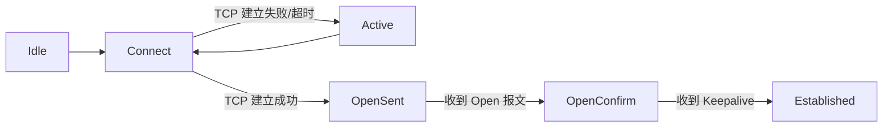
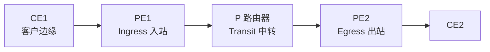

## 一、OSPF 进阶⭐⭐⭐

### （一）LSA 类型

| LSA | 名称 | 产生者 | 作用 |
| --- | ---- | ------ | ---- |
| 1 | Router LSA | 每台路由器 | 描述本路由器接口状态与邻居（区域内泛洪） |
| 2 | Network LSA | DR | 描述广播网段内所有路由器（区域内泛洪） |
| 3 | Summary LSA | ABR | 区域间路由汇总信息 |
| 4 | ASBR Summary LSA | ABR | 通告 ASBR 的位置 |
| 5 | AS External LSA | ASBR | 外部路由（全 AS 泛洪，不做汇总时每个外部路由一条） |
| 7 | NSSA External LSA | ASBR | NSSA 区域内外部路由，由 ABR 转成 LSA 5 后传出 |

### （二）特殊区域⭐⭐⭐

| 区域类型 | 允许的 LSA | 特点 |
| -------- | ---------- | ---- |
| Stub 区域 | 1、2、3（默认路由） | 禁止 LSA 4/5，区域内不能有 ASBR，虚链路不能穿越 |
| Totally Stub | 1、2、默认路由 | Stub 基础上再禁止 LSA 3（只留一条默认路由） |
| NSSA | 1、2、3、7 | 允许外部路由（用 LSA 7），区域内有 ASBR |
| Totally NSSA | 1、2、7、默认路由 | NSSA 基础上禁止 LSA 3 |

### （三）认证与网络类型

- 认证方式：**区域认证**（区域内所有接口）与**接口认证**（仅单个接口，优先级更高）
- 认证模式：明文、MD5、HMAC-SHA256
- 网络类型：广播（Broadcast）、NBMA、点到多点（P2MP）、点到点（P2P）
  - 广播与 NBMA 需选举 DR/BDR；P2P 无需选举，Hello 10s；NBMA 采用单播发送，Hello 30s

### （四）其他高频考点

- **silent-interface**（沉默接口）：不发送/接收 Hello，用于连接终端的接口
- 路由汇总：区域间汇总（ABR 上 `abr-summary`）、外部路由汇总（ASBR 上 `asbr-summary`）
- 虚链路（Virtual Link）：用于区域连接到骨干（Area 0）的迂回路径
- OSPF 与静态路由比较：无环、收敛快、自动适应拓扑变化

## 二、IS-IS

### （一）基本概念

- 基于 **CLNP**（无连接网络协议）的**链路状态**路由协议，运行在数据链路层之上
- 常用于运营商与大型企业骨干网，与 OSPF 同为 IGP
- NET 地址（网络实体名称）：区域地址 + 系统 ID（6 字节）+ SEL（固定 00），长度 8~20 字节

### （二）区域与路由器类型⭐⭐⭐

| 类型 | 说明 |
| ---- | ---- |
| Level-1 路由器 | 只在同一区域内（类似 OSPF 内部路由器），维护 L1 LSDB |
| Level-2 路由器 | 区域间路由（类似骨干），维护 L2 LSDB |
| Level-1-2 路由器 | 同时参与 L1 与 L2，ABR 角色 |

- L1 路由器访问其他区域：通过默认路由指向最近的 **L1/L2** 路由器
- **路由渗透**：L1/L2 路由器将 L2 路由引入 L1 区域，优化区域出口路径

### （三）DIS 与伪节点

- 广播网络中选举 **DIS**（指定中间系统），优先级越大越优先（默认 64，0 也能参与）
- DIS 创建**伪节点**，由伪节点生成 LSP，避免全网状邻接（类似 OSPF 的 DR）
- 报文：Hello（IIH）、LSP（链路状态 PDU）、SNP（CSNP 完整/PSNP 部分）

## 三、BGP⭐⭐⭐

### （一）BGP 是干什么的

**BGP（边界网关协议）** 是**外部网关协议（EGP）**，用于 **AS（自治系统）之间**交换路由：

- 基于 **TCP 179 端口**建立会话（可靠传输）
- **路径矢量协议**：路由携带经过的 AS 路径（AS_Path），天然防环
- 不发现、不计算路由，只负责**传递路由**（BGP 本身不是 IGP）

### （二）BGP 状态机⭐⭐⭐

Established 后通过 Update 报文交换路由。

### （三）报文与邻居

| 报文 | 作用 |
| ---- | ---- |
| Open | 建立邻居关系（协商版本、AS 号、Hold 时间） |
| Update | 通告/撤销路由（携带 NLRI 与属性） |
| Keepalive | 保活（默认 60s 一次，Hold 180s） |
| Notification | 错误通知（邻居关系直接断开） |
| Route-Refresh | 请求重新通告路由（软复位） |

| 邻居类型 | 特点 |
| -------- | ---- |
| EBGP | 不同 AS 之间；默认 TTL=1（直连），可用 ebgp-max-hop 配置多跳 |
| IBGP | 同一 AS 内；默认 TTL=64；需逻辑全互联，否则用路由反射器/联邦 |

### （四）路由属性⭐⭐⭐

| 属性 | 类别 | 规则 |
| ---- | ---- | ---- |
| Preferred-Value | 私有 | 越大越优（本地有效） |
| Local_Pref | 公认自决 | 越大越优，默认 100，只在 AS 内传递 |
| AS_Path | 公认必遵 | 越短越优 |
| Origin | 公认必遵 | IGP < EGP < Incomplete |
| MED | 可选非传递 | 越小越优，默认 0，仅在相邻 AS 间传递 |
| Next_Hop | 公认必遵 | 必须可达，否则路由不可用 |
| Community | 可选传递 | 团体属性（如 No_Export 等） |

### （五）路由反射器 RR⭐⭐⭐

- IBGP 全互联成本高 → 引入 **RR（路由反射器）**：Client 只需与 RR 建立邻居
- RR 反射规则：从 Client 学到的路由反射给其他 Client；从非 Client 学到的只反射给 Client
- 防环：Originator_ID、Cluster_List 属性
- 备选方案：**联邦（Confederation）**：AS 内划分子 AS，子 AS 之间按 EBGP 规则

## 四、路由控制与重发布⭐⭐⭐

### （一）路由策略工具

| 工具 | 作用 |
| ---- | ---- |
| ACL | 匹配报文/路由的 IP 特征 |
| IP-Prefix（前缀列表） | 精确匹配路由前缀+掩码（greater-equal / less-equal） |
| Filter-Policy | 在协议上过滤路由（入/出方向） |
| Route-Policy | if-match 匹配 + apply 修改属性，可被 import/export 调用 |

### （二）路由重发布

- 作用：将一种协议的路由引入另一种协议（`import-route`）
- 注意：
  - 各协议**度量值不通用**，重发布时需指定种子度量（如 OSPF 外部默认 1）
  - 重发布易产生**路由回灌**（环路），需用过滤工具防止次优路由与环路
  - OSPF 重发布的直连/静态/其他协议路由作为 **LSA 5/7** 注入

### （三）常见考点

- 静态路由也支持绑定 Track/BFD 实现快速切换
- 路由汇总可减少路由表项，注意汇总地址要包含所有子网

## 五、交换技术进阶⭐⭐⭐

### （一）VLAN 高级特性

| 技术 | 作用 |
| ---- | ---- |
| GVRP | 交换机间自动注册/传播 VLAN（GARP 协议族） |
| Super-VLAN | 多个 Sub-VLAN 共用一个三层 VLANIF，节省 IP 地址（需开启 ARP 代理） |
| MUX VLAN | 主 VLAN + 隔离组/互通组，实现二层隔离（端口隔离替代方案） |
| QinQ | 二层隧道，报文打双层 802.1Q 标签，用于城域网隔离用户 |

### （二）链路聚合 Eth-Trunk

- 作用：增加带宽 + 链路冗余
- 模式：
  - **手工模式**：无协商，双方都配置
  - **LACP 模式**：主动/被动协商，备份链路自动接管
- 负载分担：基于流（源/目的 MAC、IP、端口）哈希

### （三）堆叠与集群

- **iStack**（框式交换机堆叠）：多台交换机虚拟成一台，统一管理
- **CSS**（集群交换机系统）：框式设备集群
- 优点：提高可靠性（跨设备链路聚合）、简化管理

### （四）MSTP 多实例生成树⭐⭐⭐

- 为每个 VLAN 或 VLAN 组创建一个**实例（Instance）**，各实例独立计算生成树
- 优点：不同实例可负载分担（一条链路阻塞另一条转发），优于 STP/RSTP 的全局单树
- 命令：`stp region-configuration` 下 `instance 1 vlan 10 20`，再 `active region-configuration`

### （五）二层安全

| 技术 | 作用 |
| ---- | ---- |
| 端口安全 | 限制端口 MAC 地址学习数量，防 MAC 泛洪 |
| DHCP Snooping | 信任/非信任端口，防止 DHCP 欺骗；非信任端口丢弃 DHCP Offer/Ack |
| DAI | 动态 ARP 检测：校验 ARP 报文与 DHCP 绑定表，防 ARP 欺骗 |
| IPSG | IP 源地址防护：非信任端口丢弃源 IP 不在绑定表的报文 |

## 六、MPLS⭐⭐⭐

### （一）MPLS 是干什么的

**MPLS（多协议标签交换）**：在 IP 转发的基础上引入**标签**，按标签转发（标签交换），转发更快、支持流量工程与 VPN：

### （二）关键概念

- **LSR**：标签交换路由器；**LER**：边缘标签路由器（Ingress/Egress）
- **FEC**：转发等价类（同一 FEC 使用同一标签）
- **LDP**：标签分发协议，动态分配/通告标签
- **PHP**：次末跳弹出（倒数第二跳弹出标签，减轻 Egress 负担）
- 标签：20 位，打在二层头与 IP 头之间（"Shim" 标签栈）

### （三）应用

- **MPLS VPN**（L3VPN）：见第七章
- MPLS TE（流量工程）、MPLS QoS

## 七、VPN 技术⭐⭐⭐

### （一）隧道类 VPN

| 技术 | 特点 |
| ---- | ---- |
| GRE | 通用路由封装（协议 47），可封装多种协议，本身不加密 |
| L2TP | 二层隧道协议，用于远程拨号（LAC/LNS） |
| IPsec | 提供加密+认证，最常用的站点间/远程 VPN |

### （二）IPsec 细节

- 协议：
  - **AH**（协议 51）：完整性+源认证，不加密
  - **ESP**（协议 50）：加密+认证，最常用
- **IKE**：密钥协商（UDP 500 端口），SA 建立分两个阶段（IKE SA + IPsec SA）
- 模式：**传输模式**（只封装载荷，主机间）、**隧道模式**（封装整个 IP 包，网关间）

### （三）MPLS L3VPN⭐⭐⭐

- **VRF**：每 VPN 独立的路由转发表（CE 侧收/发）
- **RD（路由区分符）**：使不同 VPN 的重叠地址不冲突（VPNv4 地址 = RD + IPv4 前缀）
- **RT（路由目标）**：import/export 控制路由在 VPN 间传递（谁收谁发）
- **MP-BGP**（VPNv4 地址族）：在 PE 之间传递 VPN 路由
- 数据转发：MPLS 双层标签（外层到对端 PE，内层标识 VPN 实例）

## 八、组播技术

### （一）组播基础

- 组播地址：**224.0.0.0/4**（D 类）
- 组播源发送一份数据，路由器复制分发，节省带宽
- 组播三要素：源、组播组（组播组地址）、成员

### （二）IGMP（组播组成员管理）

| 版本 | 机制 |
| ---- | ---- |
| IGMPv1 | 查询器周期查询，成员被动响应；无离开机制 |
| IGMPv2 | 增加**离开组报文**与特定组查询，减少离开延迟 |
| IGMPv3 | 支持指定源（SSM） |

### （三）PIM 协议⭐⭐⭐

| 模式 | 特点 | 适用 |
| ---- | ---- | ---- |
| PIM-DM 密集模式 | 先洪泛后剪枝，周期性刷新；源短、组成员多 | 小规模网络 |
| PIM-SM 稀疏模式 | 显式加入（Join），依赖 **RP（汇聚点）**，可切换 SPT 最短路径树 | 大规模网络 |

- RP：接收者注册与源注册的汇聚点；可静态配置或 BSR/自动选举

## 九、可靠性技术⭐⭐⭐

### （一）BFD 双向转发检测

- 作用：**亚秒级**（毫秒级）检测链路/转发故障，联动路由协议快速收敛
- 原理：周期发送 BFD 报文，连续 3 次未收到即判定故障
- 常联动：静态路由（track）、OSPF、BGP、VRRP

### （二）VRRP 虚拟路由冗余协议⭐⭐⭐

- 作用：多台路由器组成一个**虚拟路由器**，对外提供统一虚拟 IP，实现网关冗余
- 优先级 1~254（默认 100），越大越优先，**Master 选举**：优先级 → IP 地址
- 虚拟 MAC：00-00-5E-00-01-XX
- VRRPv2 支持 IPv4；VRRPv3 支持 IPv4/IPv6
- 抢占模式：Backup 检测到 Master 故障（默认 1s 后）抢占为 Master

## 十、网络安全基础

| 技术 | 作用 |
| ---- | ---- |
| 防火墙状态检测 | 基于会话表跟踪连接状态，只放行会话内报文 |
| AAA | 认证（Authentication）+授权（Authorization）+计费（Accounting），支持 RADIUS/TACACS+ |
| ACL 高级应用 | 结合时间段（time-range）、深度包过滤 |
| NAT 安全 | 隐藏内网、防止外部主动访问 |

## 十一、网络管理

| 技术 | 要点 |
| ---- | ---- |
| SNMPv1/v2c | 团体名（community）认证，明文，不安全 |
| SNMPv3 | 基于用户的安全模型（USM），支持认证+加密 |
| 网管平台 | eSight、Zabbix 等；日志分级（emergency~debug） |

## 十二、故障排查思路⭐⭐⭐

| 现象 | 排查方向 |
| ---- | -------- |
| OSPF 邻居起不来 | 接口区域/掩码/Hello 间隔/认证/网络类型不一致 |
| BGP 邻居起不来 | TCP 可达性、AS 号、Update-Source、TTL、Hold 时间 |
| 路由不优/环路 | 优先级、度量、重发布回灌、路由过滤方向 |
| VLAN 不通 | 端口类型、PVID、Trunk 放行、允许列表 |
| VPN 不通 | RT import/export、RD 冲突、MP-BGP 邻居、标签协商 |
| 组播收不到 | IGMP 版本、PIM 模式、RP 可达性、组播边界 |

常用命令：`display bgp peer`、`display ospf peer`、`display mpls ldp peer`、`display ip routing-table`、`display vrrp`、`display current-configuration`
