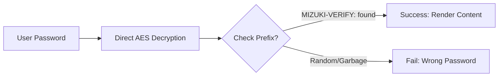

此博客模板使用 [Astro](https://astro.build/) 构建。本指南未提及的内容，您可以在 [Astro 文档](https://docs.astro.build/) 中找到答案。

## 文章的前置元数据

```yaml
---
title: 我的第一篇博客文章
published: 2023-09-09
description: 这是我的新 Astro 博客的第一篇文章。
image: ./cover.jpg
tags: [示例, 测试]
category: 前端
draft: false
---
```

| 属性           | 描述                                                                                                                                                             |
| -------------- | ---------------------------------------------------------------------------------------------------------------------------------------------------------------- |
| `title`        | 文章的标题。                                                                                                                                                     |
| `published`    | 文章的发布日期。                                                                                                                                                 |
| `pinned`       | 是否将此文章置顶于文章列表顶部。                                                                                                                                 |
| `description`  | 文章的简短描述。在首页显示。                                                                                                                                     |
| `image`        | 文章的封面图片路径。<br/>1. 以 `http://` 或 `https://` 开头：使用网络图片<br/>2. 以 `/` 开头：指向 `public` 目录中的图片<br/>3. 无上述前缀：相对于 markdown 文件 |
| `tags`         | 文章的标签。                                                                                                                                                     |
| `category`     | 文章的分类。                                                                                                                                                     |
| `alias`        | 文章的别名。文章可通过 `/posts/{alias}/` 访问。例如：`my-special-article`（可通过 `/posts/my-special-article/` 访问）                                           |
| `licenseName`  | 文章内容的许可证名称。                                                                                                                                           |
| `author`       | 文章的作者。                                                                                                                                                     |
| `sourceLink`   | 文章内容的源链接或参考来源。                                                                                                                                     |
| `draft`        | 如果文章仍是草稿，则不会显示。                                                                                                                                   |

## 文章文件的存放位置

您的文章文件应放置在 `src/content/posts/` 目录下。您也可以创建子目录来更好地组织您的文章和资源文件。

```
src/content/posts/
├── post-1.md
└── post-2/
    ├── cover.png
    └── index.md
```

## 文章别名

您可以通过在 front-matter 中添加 `alias` 字段为任意文章设置别名：

```yaml
---
title: 我的特别文章
published: 2024-01-15
alias: "my-special-article"
tags: ["示例"]
category: "技术"
---
```

设置别名后：
- 文章将通过自定义 URL 访问（例如 `/posts/my-special-article/`）
- 默认的 `/posts/{slug}/` URL 仍然有效
- RSS/Atom 订阅将使用自定义别名
- 所有内部链接将自动使用自定义别名

**重要说明：**
- 别名**不应**包含 `/posts/` 前缀（将自动添加）
- 避免在别名中使用特殊字符和空格
- 为获得最佳 SEO 效果，请使用小写字母和连字符
- 确保所有文章的别名唯一
- 不要包含前导或尾随斜杠

## 工作原理

